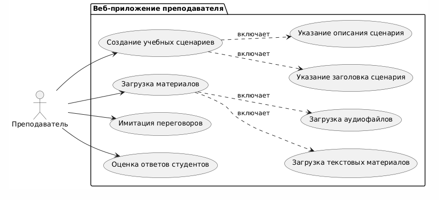
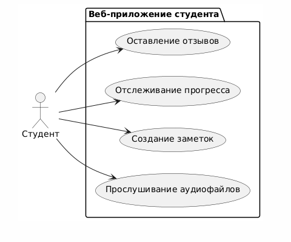

1. Перечень заинтересованных лиц

Учебные заведения/Преподаватели: 
Описание: Основные пользователи системы. Им необходимо удобное средство для создания
и организации учебных материалов, а также для оценки навыков студентов в изучении морского английского.

Студенты: 
Описание: Конечные пользователи приложения. Им важна возможность практиковать навыки общения на морском
английском в условиях, приближенных к реальным, с использованием технологии имитации переговоров по радио.

2. Перечень функциональных требований
Веб-приложение для преподавателей:

а. Создание учебных сценариев:

Преподаватель должен иметь возможность создавать сценарии переговоров, включая текстовые инструкции и ключевые фразы.
Возможность указания заголовков и описаний для каждого сценария.

б. Загрузка материалов:

Преподаватель может загружать текстовые материалы, изображения и аудиофайлы, связанные с морским английским.
Необходима поддержка различных форматов файлов для медиаматериалов.

в. Имитация переговоров:

Возможность виртуально воспроизводить сценарии переговоров с наложением шумов и акцентов.
Опциональная возможность привязывать сценарии к конкретным учебным темам.

г. Оценка ответов студентов:

Возможность записи и сравнения ответов студентов с эталонными звуковыми дорожками.
Автоматическая оценка правильности произношения и использования фраз.

Веб-приложение для студентов:

а. Прослушивание учебных материалов:

Возможность прослушивания загруженных аудиофайлов с примерами переговоров.
Поддержка отображения текстовых материалов и ключевых фраз при прослушивании.

б. Практика общения:

Возможность записи ответов студентов во время имитации переговоров.
Опциональная возможность прослушивания своих записей и сравнения с эталонными.

в. Оценка навыков:

Получение обратной связи по правильности произношения и использованию фраз.
Возможность просмотра статистики прогресса в изучении.

3. Диаграмма вариантов использования для функциональных требований
Диаграмма прецедентов для функциональных требований веб-приложения преподавателя

@startuml

left to right direction

actor "Преподаватель" as act
package "Веб-приложение преподавателя" {
  usecase UC1 as "Создание учебных сценариев"
  usecase UC2 as "Загрузка материалов"
  usecase UC3 as "Имитация переговоров"
  usecase UC4 as "Оценка ответов студентов"
  usecase UC5 as "Указание заголовка сценария"
  usecase UC6 as "Указание описания сценария"
  usecase UC7 as "Загрузка текстовых материалов"
  usecase UC8 as "Загрузка аудиофайлов"
}

act --> UC1
act --> UC2
act --> UC3
act --> UC4
UC1 ..> UC5: включает
UC1 ..> UC6: включает
UC2 ..> UC7: включает
UC2 ..> UC8: включает

@enduml

Диаграмма прецедентов для функциональных требований веб-приложения студентов

@startuml

left to right direction

actor "Студент" as act
package "Веб-приложение студента" {
  usecase UC1 as "Прослушивание учебных материалов"
  usecase UC2 as "Практика общения"
  usecase UC3 as "Оценка навыков"
  usecase UC4 as "Просмотр статистики прогресса"
}

act --> UC1
act --> UC2
act --> UC3
UC2 ..> UC4: включает

@enduml

4. Перечень сделанных предположений

Технические предположения:
Использование веб-технологий (HTML, CSS, JavaScript) для разработки веб-приложений.
Аудиофайлы могут быть загружены в систему без необходимости физического присутствия преподавателя.

Бизнес-предположения:
Учебные заведения будут использовать приложение для улучшения процесса обучения студентов в области морского
английского.

5. Перечень нефункциональных требований

Безопасность:
Данные студентов и материалы преподавателей должны храниться в зашифрованном виде.
Аутентификация и авторизация должны быть реализованы с использованием современных стандартов безопасности.

Надежность:
Данные должны быть доступны в режиме реального времени через веб-приложение.
Совместимость:

Совместимость:
Приложение должно быть совместимо с основными браузерами (Chrome, Firefox, Safari, Edge).

Удобство использования:
Веб-приложение должно иметь интуитивно понятный интерфейс, чтобы пользователи могли легко находить необходимые функции.