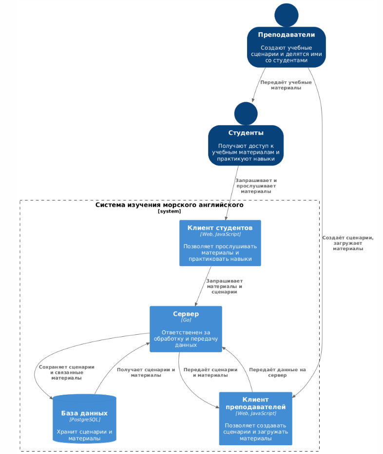
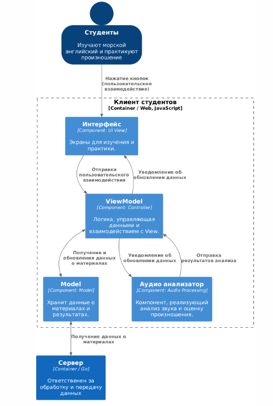
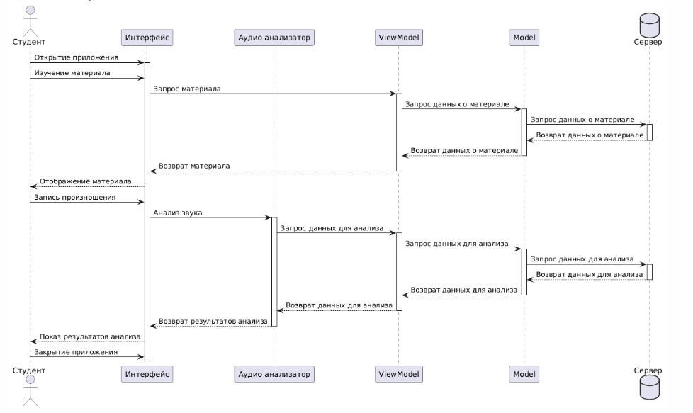
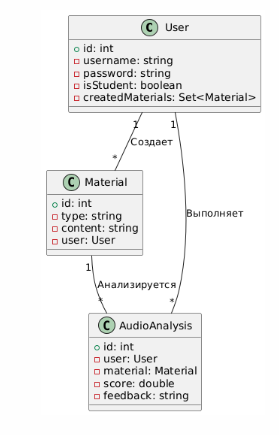

Диаграмма контейнеров

@startuml
!include https://raw.githubusercontent.com/plantuml-stdlib/C4-PlantUML/master/C4_Container.puml

SHOW_PERSON_OUTLINE()

Person(teachers, Преподаватели, "Создают учебные сценарии и делятся ими со студентами")
Person(students, Студенты, "Получают доступ к учебным материалам и практикуют навыки")
System_Boundary(c1, "Система изучения морского английского") {
    Container(clientTeachers, "Клиент преподавателей", "Web, JavaScript", "Позволяет создавать сценарии и загружать материалы")
    Container(clientStudents, "Клиент студентов", "Web, JavaScript", "Позволяет прослушивать материалы и практиковать навыки")
    Container(server, "Сервер", "Go", "Ответственен за обработку и передачу данных")
    ContainerDb(db, "База данных", "PostgreSQL", "Хранит сценарии и материалы", $sprite="msql_server")
}

Rel_D(teachers, clientTeachers, "Создаёт сценарии, загружает материалы")
Rel_D(clientTeachers, server, "Передаёт данные на сервер")
Rel_D(server, db, "Сохраняет сценарии и связанные материалы")
Rel_U(db, server, "Получает сценарии и материалы")
Rel_D(server, clientTeachers, "Передаёт сценарии и материалы")
Rel_D(teachers, students, "Передаёт учебные материалы")
Rel_D(students, clientStudents, "Запрашивает и прослушивает материалы")
Rel_D(clientStudents, server, "Запрашивает материалы и сценарии")

SHOW_LEGEND()
@enduml

Диаграмма компонентов

@startuml
!include https://raw.githubusercontent.com/plantuml-stdlib/C4-PlantUML/master/C4_Container.puml

AddElementTag("microService", $shape=EightSidedShape(), $bgColor="CornflowerBlue", $fontColor="white", $legendText="micro service\neight sided")
AddElementTag("storage", $shape=RoundedBoxShape(), $bgColor="lightSkyBlue", $fontColor="white")

SHOW_PERSON_OUTLINE()

Person(students, Студенты, "Изучают морской английский и практикуют произношение")
System(s, "Сервер", "Ответственен за обработку и передачу данных", $type="Container / Go")
Boundary(c, "Клиент студентов", "Container / Web, JavaScript") {
    Container(v, "Интерфейс", "Component: UI View", "Экраны для изучения и практики.")
    Container(vm, "ViewModel", "Component: Controller", "Логика, управляющая данными и взаимодействием с View.")
    Container(m, "Model", "Component: Model", "Хранит данные о материалах и результатах.")
    Container(ar, "Аудио анализатор", "Component: Audio Processing", "Компонент, реализующий анализ звука и оценку произношения.")
}
Rel_D(students, v, "Нажатие кнопок (пользовательское взаимодействие)")
Rel_D(v, vm, "Отправка пользовательского взаимодействия")
Rel_D(vm, v, "Уведомление об обновлении данных")
BiRel(vm, m, "Получение и обновления данных о материалах")
Rel_D(vm, ar, "Уведомление об обновлении данных")
BiRel(m, s, "Получение данных о материалах")
Rel_D(ar, vm, "Отправка результатов анализа")

SHOW_LEGEND()
@enduml

Диаграмма последовательности

@startuml
actor Студент as Student
participant "Интерфейс" as MobileApp
participant "Аудио анализатор" as AudioAnalyzer
participant "ViewModel" as ViewModel
participant "Model" as Model
database "Сервер" as Server

Student -> MobileApp: Открытие приложения

activate MobileApp
Student -> MobileApp: Изучение материала
MobileApp -> ViewModel: Запрос материала

activate ViewModel
ViewModel -> Model: Запрос данных о материале

activate Model
Model -> Server: Запрос данных о материале

activate Server
Server --> Model: Возврат данных о материале
deactivate Server

Model --> ViewModel: Возврат данных о материале
deactivate Model

ViewModel --> MobileApp: Возврат материала
deactivate ViewModel

MobileApp --> Student: Отображение материала

Student -> MobileApp: Запись произношения
MobileApp -> AudioAnalyzer: Анализ звука

activate AudioAnalyzer
AudioAnalyzer -> ViewModel: Запрос данных для анализа

activate ViewModel
ViewModel -> Model: Запрос данных для анализа

activate Model
Model -> Server: Запрос данных для анализа

activate Server
Server --> Model: Возврат данных для анализа
deactivate Server

Model --> ViewModel: Возврат данных для анализа
deactivate Model

ViewModel --> AudioAnalyzer: Возврат данных для анализа
deactivate ViewModel

AudioAnalyzer --> MobileApp: Возврат результатов анализа
deactivate AudioAnalyzer

MobileApp --> Student: Показ результатов анализа

Student -> MobileApp: Закрытие приложения
@enduml

Пояснения:
1) Открытие приложения:
Студент запускает приложение.
2) Изучение материала:
Студент запрашивает изучение материала.
Приложение отправляет запрос в ViewModel.
ViewModel запрашивает данные у Model.
Model обращается к серверу за данными.
Сервер возвращает данные, которые передаются обратно через Model и ViewModel в мобильное приложение.
Мобильное приложение отображает материал.
3) Запись произношения:
Студент инициирует запись произношения.
Приложение отправляет запрос на анализ звука в AudioAnalyzer.
4) Анализ звука:
AudioAnalyzer запрашивает данные у ViewModel.
ViewModel запрашивает данные у Model.
Model обращается к серверу за данными для анализа.
Сервер возвращает данные, которые передаются обратно в AudioAnalyzer через Model и ViewModel.
AudioAnalyzer возвращает результаты анализа в приложение.
Приложение отображает результаты анализа.
5) Закрытие приложения:
Студент закрывает приложение.

Модель базы данных

@startuml
class User {
  +id: int
  -username: string
  -password: string
  -isStudent: boolean
  -createdMaterials: Set<Material>
}

class Material {
  +id: int
  -type: string
  -content: string
  -user: User
}

class AudioAnalysis {
  +id: int
  -user: User
  -material: Material
  -score: double
  -feedback: string
}

User  "1" -- "*" Material: Создает
User  "1" -- "*" AudioAnalysis: Выполняет
Material "1" -- "*" AudioAnalysis: Анализируется
@enduml

Пояснение:
Класс User:
Представляет пользователя системы.

Класс Material:
Представляет учебный материал - его содержание.

Класс AudioAnalysis:
Представляет анализ произношения - содержит оценку и обратную связь для студента.

Связи между классами:
User создает Material: Один пользователь может создавать множество материалов (отношение "один ко многим").
User выполняет AudioAnalysis: Один пользователь может выполнять множество анализов произношения (отношение "один ко многим").
Material анализируется в AudioAnalysis: Один материал может быть проанализирован в нескольких анализах произношения (отношение "один ко многим").

Код
package main

import (
	"errors"
	"fmt"
)

// Service - интерфейс для получения данных
type Service[T any] interface {
	FetchData(id any) ([]T, error)
}

// Material - структура для хранения информации о материале
type Material struct {
	ID      int
	Type    string
	Content string
	UserID  int
}

// AudioAnalysis - структура для хранения информации об анализе произношения
type AudioAnalysis struct {
	ID        int
	UserID    int
	MaterialID int
	Score     float64
	Feedback  string
}

// MaterialService - структура для работы с материалами
type MaterialService struct {
	data []Material
}

// FetchData - метод для получения материалов
func (ms *MaterialService) FetchData(id any) ([]Material, error) {
	// Логика получения материалов
	// Здесь можно добавить логику для получения данных, например, из базы данных или API

	// В случае успеха
	return ms.data, nil

	// В случае ошибки
	// return nil, errors.New("ошибка получения данных")
}

// AudioAnalysisService - структура для работы с анализом произношения
type AudioAnalysisService struct {
	data []AudioAnalysis
}

// FetchData - метод для получения анализа произношения
func (aas *AudioAnalysisService) FetchData(id any) ([]AudioAnalysis, error) {
	// Логика получения анализа произношения
	// Здесь можно добавить логику для получения данных, например, из базы данных или API

	// В случае успеха
	return aas.data, nil

	// В случае ошибки
	// return nil, errors.New("ошибка получения данных")
}

// MainViewController - структура для управления представлением
type MainViewController struct {
	materialService      Service[Material]
	analysisService      Service[AudioAnalysis]
}

func (mvc *MainViewController) GetMaterials() {
	materials, err := mvc.materialService.FetchData(nil)
	if err != nil {
		// Обработка ошибки
		fmt.Println("Ошибка получения материалов:", err)
		return
	}
	// Обработка материалов
	fmt.Println("Полученные материалы:", materials)
}

func (mvc *MainViewController) AnalyzePronunciation(materialID int) {
	analyses, err := mvc.analysisService.FetchData(materialID)
	if err != nil {
		// Обработка ошибки
		fmt.Println("Ошибка получения анализа:", err)
		return
	}
	// Обработка результатов анализа
	fmt.Println("Полученные результаты анализа:", analyses)
}

func main() {
	// Пример использования
	mvc := MainViewController{
		materialService: &MaterialService{
			data: []Material{
				{ID: 1, Type: "Текст", Content: "Пример текста", UserID: 1},
			},
		},
		analysisService: &AudioAnalysisService{
			data: []AudioAnalysis{
				{ID: 1, UserID: 1, MaterialID: 1, Score: 95.0, Feedback: "Отлично!"},
			},
		},
	}

	mvc.GetMaterials()
	mvc.AnalyzePronunciation(1)
}
Объяснение принципов
KISS (Keep It Simple, Stupid):
Классы MaterialService и AudioAnalysisService предоставляют простые методы для получения материалов и анализа
произношения. Они скрывают сложность внутренней реализации, обеспечивая клиентскому коду простоту взаимодействия.

YAGNI (You Aren't Gonna Need It):
Реализована только минимально необходимая функциональность для получения материалов и анализа произношения.
Нет изыточной сложности, реализована исключительно необходимая функциональности

DRY (Don't Repeat Yourself):
Разработка кода направлена на избежание повторений, с единой, повторно используемой логикой для обработки ответов от сервисов.

SOLID:

S (Single Responsibility Principle): Каждый из классов имеет одну основную ответственность - предоставление данных о материалах или анализе произношения.
O (Open/Closed Principle): Используем протокол Service, который позволяет добавлять новые сервисы, не изменяя существующий код.
L (Liskov Substitution Principle): Принцип неявно соблюдается, так как все сервисы реализуют один и тот же протокол.
I (Interface Segregation Principle): Протоколы содержат только необходимые методы, что позволяет избежать избыточности.
D (Dependency Inversion Principle): Создаём объект типа Service и можем ему подсовывать любые сервисы, выполняющие этот протокол.

Другие принципы разработки
BDUF - Big Design Up Front (Масштабное проектирование прежде всего)
Применимость в проекте: Принцип BDUF может быть особенно полезен в моём проекте, так как требования к приложению для изучения
морского английского четко определены. Это позволяет учесть все детали проектирования на ранних этапах, что минимизирует
риск значительных изменений в ходе разработки. Можно заранее спроектировать архитектуру приложения, интерфейсы
и взаимодействия между компонентами, что обеспечит более плавный процесс разработки.

Обоснование отказа: Однако в современных условиях, где требования могут меняться, гибкие методологии разработки становятся более
предпочтительными. BDUF может оказаться избыточным и затруднить адаптацию к изменениям, особенно если в процессе
разработки возникнут новые идеи или потребности пользователей.

Решение: Поскольку мой проект разрабатывается по методологии водопада, применение BDUF будет оправдано. Можно заранее
спланировать все этапы и избежать неожиданных изменений в будущем.

SoC - Separation of Concerns (Принцип разделения ответственности)
Применимость в проекте: Принцип SoC будет активно применяться в моём проекте, так как он способствует легкости поддержки, 
повторному использованию кода и тестированию. Я буду разделять код на логические компоненты, такие как сервисы для
работы с материалами и анализом произношения, а также пользовательский интерфейс. Это упростит понимание кода и его
модификацию, что особенно важно для долгосрочной поддержки приложения.

Обоснование отказа: В некоторых случаях, например, в простых проектах, чрезмерное разделение может привести к избыточности кода и
усложнению проекта без необходимости. Надо следить за тем, чтобы не перегружать систему излишними абстракциями.

Решение: В нашем проекте принцип SoC уже используется, так как он перекликается с принципом единственной ответственности
(S из SOLID). Каждый компонент будет иметь четко определенные обязанности.

MVP - Minimum Viable Product (Минимально жизнеспособный продукт)
Применимость в проекте: Использование MVP в моём проекте позволит быстро внедрить базовую функциональность приложения и получить
обратную связь от пользователей. Это поможет лучше понять требования и улучшить продукт на ранних этапах, что особенно
важно в контексте изучения морского английского, где потребности пользователей могут варьироваться.

Обоснование отказа: В некоторых ситуациях, например, в проектах с высоким техническим риском, может потребоваться более детальное
прототипирование или анализ перед разработкой MVP. Однако в моём случае мы можем сосредоточиться на основных функциях,
таких как предоставление учебных материалов и анализ произношения.

Решение: В рамках ограниченности времени, так как проект привязан к графику учебного процесса, применение MVP будет
целесообразным. Я смогу быстро протестировать основные функции и внести необходимые изменения на основе отзывов
пользователей.

PoC - Proof of Concept (Доказательство концепции)
Применимость в проекте: PoC может быть полезен, когда необходимо оценить техническую осуществимость или эффективность конкретной
концепции перед началом полноценной разработки. В моём проекте это может включать тестирование новых технологий для
анализа произношения или интеграции с внешними API для получения учебных материалов.

Обоснование отказа: В некоторых ситуациях, когда требования к проекту хорошо известны, PoC может быть избыточным, и разработку стоит
начинать сразу с основного проекта. В моём случае, учитывая, что требования хорошо изучены и известны, PoC может
оказаться не столь необходимым.

Решение: В рамках моего проекта PoC может быть избыточен, так как проект реализуется по методологии водопада, и нет
времени на оценку эффективности новых технологий из-за сжатых сроков. Можно сосредоточиться на реализации уже 
известных и проверенных решений.