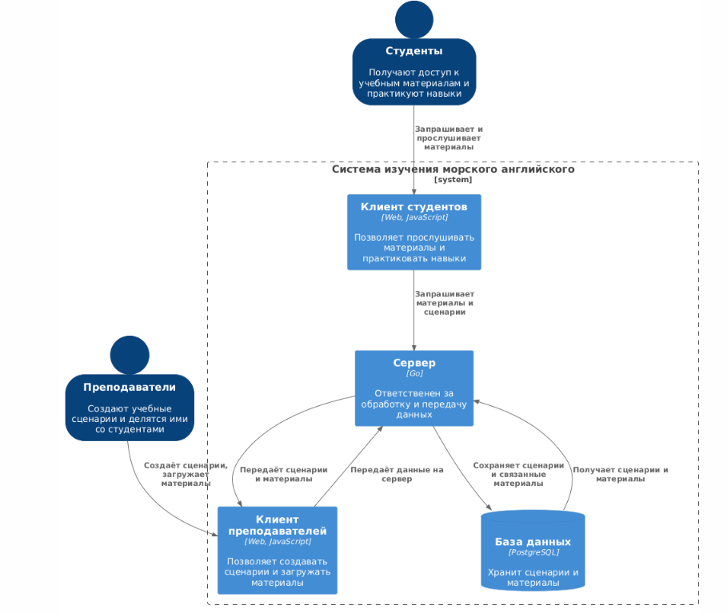
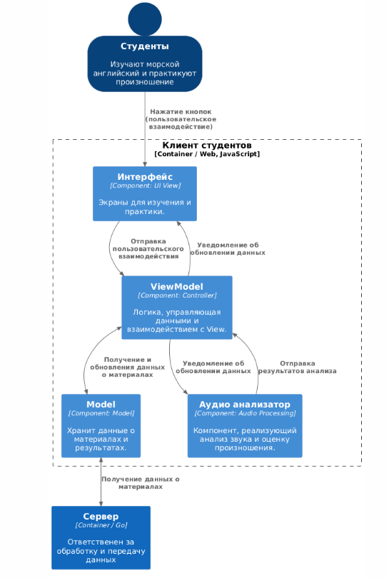
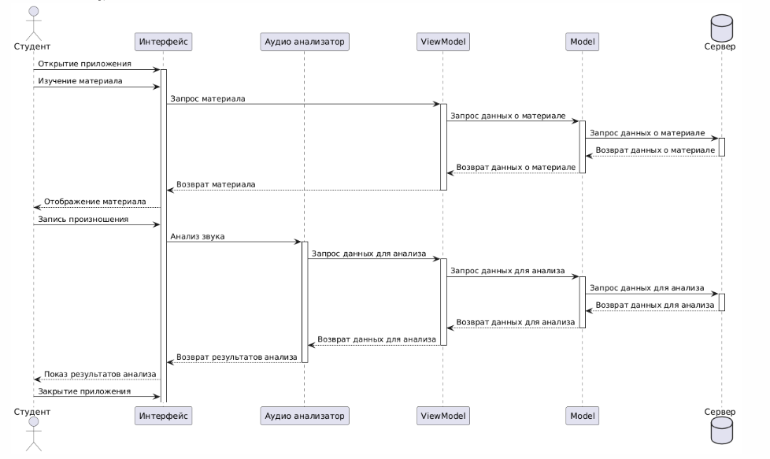
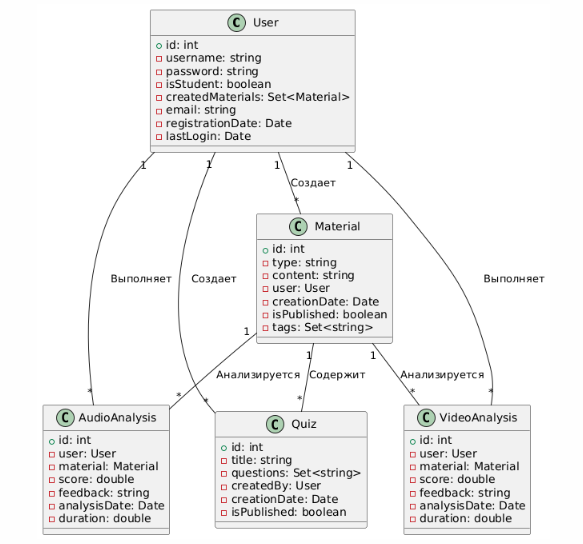

### **Диаграмма контейнеров**

### **Диаграмма компонентов**

### **Диаграмма последовательности**

Пояснения:
1) Открытие приложения:
Студент запускает приложение.
2) Изучение материала:
Студент запрашивает изучение материала.
Приложение отправляет запрос в ViewModel.
ViewModel запрашивает данные у Model.
Model обращается к серверу за данными.
Сервер возвращает данные, которые передаются обратно через Model и ViewModel в мобильное приложение.
Мобильное приложение отображает материал.
3) Запись произношения:
Студент инициирует запись произношения.
Приложение отправляет запрос на анализ звука в AudioAnalyzer.
4) Анализ звука:
AudioAnalyzer запрашивает данные у ViewModel.
ViewModel запрашивает данные у Model.
Model обращается к серверу за данными для анализа.
Сервер возвращает данные, которые передаются обратно в AudioAnalyzer через Model и ViewModel.
AudioAnalyzer возвращает результаты анализа в приложение.
Приложение отображает результаты анализа.
5) Закрытие приложения:
Студент закрывает приложение.

### **Модель базы данных**

Пояснение:
Класс User: Представляет пользователя системы, включая информацию о его учетной записи и активности.

Класс Material: Представляет учебный материал, включая его тип, содержание и метаданные, такие как дата создания и теги.

Класс AudioAnalysis: Представляет анализ произношения, содержащий оценку, обратную связь для студента, а также дату анализа и продолжительность.

Класс VideoAnalysis: Представляет анализ видео, аналогичный классу AudioAnalysis, с оценкой и обратной связью, а также дополнительными метаданными.

Класс Quiz: Представляет тест, содержащий вопросы и информацию о создателе, а также дату создания и статус публикации.

Связи между классами:

User создает Material: Один пользователь может создавать множество материалов (отношение "один ко многим").

User выполняет AudioAnalysis: Один пользователь может выполнять множество анализов произношения (отношение "один ко многим").

User выполняет VideoAnalysis: Один пользователь может выполнять множество видеоанализов (отношение "один ко многим").

User создает Quiz: Один пользователь может создавать множество тестов (отношение "один ко многим").

Material анализируется в AudioAnalysis: Один материал может быть проанализирован в нескольких анализах произношения (отношение "один ко многим").

Material анализируется в VideoAnalysis: Один материал может быть проанализирован в нескольких видеоанализах (отношение "один ко многим").

Material содержит Quiz: Один материал может содержать несколько вопросов теста (отношение "один ко многим").

### **Применение основных принципов разработки**

**Пример кода** 

`// Service - интерфейс для получения данных
type Service[T any] interface {
	FetchData(id any) ([]T, error)
}`

`// Material - структура для хранения информации о материале
type Material struct {
	ID      int
	Type    string
	Content string
	UserID  int
}`

`// AudioAnalysis - структура для хранения информации об анализе произношения
type AudioAnalysis struct {
	ID        int
	UserID    int
	MaterialID int
	Score     float64
	Feedback  string
}`

`// MaterialService - структура для работы с материалами
type MaterialService struct {
	data []Material
}`

`// FetchData - метод для получения материалов
func (ms *MaterialService) FetchData(id any) ([]Material, error) {
	// Логика получения материалов
	// Здесь можно добавить логику для получения данных, например, из базы данных или API
`
`	// В случае успеха
	return ms.data, nil`

	// В случае ошибки
	// return nil, errors.New("ошибка получения данных")
`}`

`// AudioAnalysisService - структура для работы с анализом произношения
type AudioAnalysisService struct {
	data []AudioAnalysis
}`

`// FetchData - метод для получения анализа произношения
func (aas *AudioAnalysisService) FetchData(id any) ([]AudioAnalysis, error) {
	// Логика получения анализа произношения
	// Здесь можно добавить логику для получения данных, например, из базы данных или API
`
`	// В случае успеха
	return aas.data, nil`

	// В случае ошибки
	// return nil, errors.New("ошибка получения данных")
`}`

`// MainViewController - структура для управления представлением
type MainViewController struct {
	materialService      Service[Material]
	analysisService      Service[AudioAnalysis]
}`

`func (mvc *MainViewController) GetMaterials() {
	materials, err := mvc.materialService.FetchData(nil)
	if err != nil {
		// Обработка ошибки
		fmt.Println("Ошибка получения материалов:", err)
		return
	}
	// Обработка материалов
	fmt.Println("Полученные материалы:", materials)
}`

`func (mvc *MainViewController) AnalyzePronunciation(materialID int) {
	analyses, err := mvc.analysisService.FetchData(materialID)
	if err != nil {
		// Обработка ошибки
		fmt.Println("Ошибка получения анализа:", err)
		return
	}
	// Обработка результатов анализа
	fmt.Println("Полученные результаты анализа:", analyses)
}`

`func main() {
	// Пример использования
	mvc := MainViewController{
		materialService: &MaterialService{
			data: []Material{
				{ID: 1, Type: "Текст", Content: "Пример текста", UserID: 1},
			},
		},
		analysisService: &AudioAnalysisService{
			data: []AudioAnalysis{
				{ID: 1, UserID: 1, MaterialID: 1, Score: 95.0, Feedback: "Отлично!"},
			},
		},
	}`

	mvc.GetMaterials()
	mvc.AnalyzePronunciation(1)
`}`

### **Объяснение принципов**

### **KISS** (Keep It Simple, Stupid):KISS (Keep It Simple, Stupid)

Код написан просто и понятно, без излишней сложности.

`type Service[T any] interface {
FetchData(id any) ([]T, error)
}`

Интерфейс Service определяет метод FetchData, который получает данные по идентификатору. Это простая и понятная абстракция.

### **YAGNI** (You Aren't Gonna Need It)

Не реализованы ненужные функции.

`type MaterialService struct {
data []Material
}`

Класс MaterialService содержит только необходимые поля и методы для работы с материалами. Нет лишних функций, которые могут не понадобиться.

### **DRY** (Don't Repeat Yourself):

Код переиспользуемый и не содержит дублирования.

`func (ms *MaterialService) FetchData(id any) ([]Material, error) {
return ms.data, nil
}`

Метод FetchData реализован один раз и используется для получения данных о материалах. Аналогично, AudioAnalysisService использует тот же метод для получения анализа.

### **SOLID**:

#### S - Single Responsibility Principle

Каждый класс имеет одну ответственность.

`type MaterialService struct {
data []Material
}`

MaterialService отвечает только за работу с материалами, а AudioAnalysisService — только за анализ аудиофайлов.

#### O - Open/Closed Principle

Классы открыты для расширения, но закрыты для модификации.

`type Service[T any] interface {
FetchData(id any) ([]T, error)
}`

Интерфейс Service позволяет добавлять новые реализации, не изменяя существующий код.

#### L - Liskov Substitution Principle

Объекты дочерних классов могут заменять объекты родительского класса.

`func (mvc *MainViewController) GetMaterials() {
materials, err := mvc.materialService.FetchData(nil)`

MainViewController может работать с любыми реализациями Service, что позволяет легко заменять их.

#### I - Interface Segregation Principle

Интерфейсы разделены и не содержат ненужных методов.

`type Service[T any] interface {
FetchData(id any) ([]T, error)
}`

Интерфейс Service содержит только один метод, что делает его простым и понятным.

#### D - Dependency Inversion Principle

Высокоуровневые модули не зависят от низкоуровневых.

`type MainViewController struct {
materialService      Service[Material]
analysisService      Service[AudioAnalysis]
}`

MainViewController зависит от абстракции Service, а не от конкретных реализаций, что позволяет легко заменять их.

### **Другие принципы разработки**

**BDUF - Big Design Up Front** (Масштабное проектирование прежде всего)
Применимость в проекте: Принцип BDUF может быть особенно полезен в моём проекте, так как требования к приложению для изучения
морского английского четко определены. Это позволяет учесть все детали проектирования на ранних этапах, что минимизирует
риск значительных изменений в ходе разработки. Можно заранее спроектировать архитектуру приложения, интерфейсы
и взаимодействия между компонентами, что обеспечит более плавный процесс разработки.

Обоснование отказа: Однако в современных условиях, где требования могут меняться, гибкие методологии разработки становятся более
предпочтительными. BDUF может оказаться избыточным и затруднить адаптацию к изменениям, особенно если в процессе
разработки возникнут новые идеи или потребности пользователей.

Решение: Поскольку мой проект разрабатывается по методологии водопада, применение BDUF будет оправдано. Можно заранее
спланировать все этапы и избежать неожиданных изменений в будущем.

**SoC - Separation of Concerns** (Принцип разделения ответственности)
Применимость в проекте: Принцип SoC будет активно применяться в моём проекте, так как он способствует легкости поддержки, 
повторному использованию кода и тестированию. Я буду разделять код на логические компоненты, такие как сервисы для
работы с материалами и анализом произношения, а также пользовательский интерфейс. Это упростит понимание кода и его
модификацию, что особенно важно для долгосрочной поддержки приложения.

Обоснование отказа: В некоторых случаях, например, в простых проектах, чрезмерное разделение может привести к избыточности кода и
усложнению проекта без необходимости. Надо следить за тем, чтобы не перегружать систему излишними абстракциями.

Решение: В нашем проекте принцип SoC уже используется, так как он перекликается с принципом единственной ответственности
(S из SOLID). Каждый компонент будет иметь четко определенные обязанности.

**MVP - Minimum Viable Product** (Минимально жизнеспособный продукт)
Применимость в проекте: Использование MVP в моём проекте позволит быстро внедрить базовую функциональность приложения и получить
обратную связь от пользователей. Это поможет лучше понять требования и улучшить продукт на ранних этапах, что особенно
важно в контексте изучения морского английского, где потребности пользователей могут варьироваться.

Обоснование отказа: В некоторых ситуациях, например, в проектах с высоким техническим риском, может потребоваться более детальное
прототипирование или анализ перед разработкой MVP. Однако в моём случае мы можем сосредоточиться на основных функциях,
таких как предоставление учебных материалов и анализ произношения.

Решение: В рамках ограниченности времени, так как проект привязан к графику учебного процесса, применение MVP будет
целесообразным. Я смогу быстро протестировать основные функции и внести необходимые изменения на основе отзывов
пользователей.

**PoC - Proof of Concept (Доказательство концепции)**

Применимость в проекте: PoC может быть полезен, когда необходимо оценить техническую осуществимость или эффективность конкретной
концепции перед началом полноценной разработки. В моём проекте это может включать тестирование новых технологий для
анализа произношения или интеграции с внешними API для получения учебных материалов.

Обоснование отказа: В некоторых ситуациях, когда требования к проекту хорошо известны, PoC может быть избыточным, и разработку стоит
начинать сразу с основного проекта. В моём случае, учитывая, что требования хорошо изучены и известны, PoC может
оказаться не столь необходимым.

Решение: В рамках моего проекта PoC может быть избыточен, так как проект реализуется по методологии водопада, и нет
времени на оценку эффективности новых технологий из-за сжатых сроков. Можно сосредоточиться на реализации уже 
известных и проверенных решений.