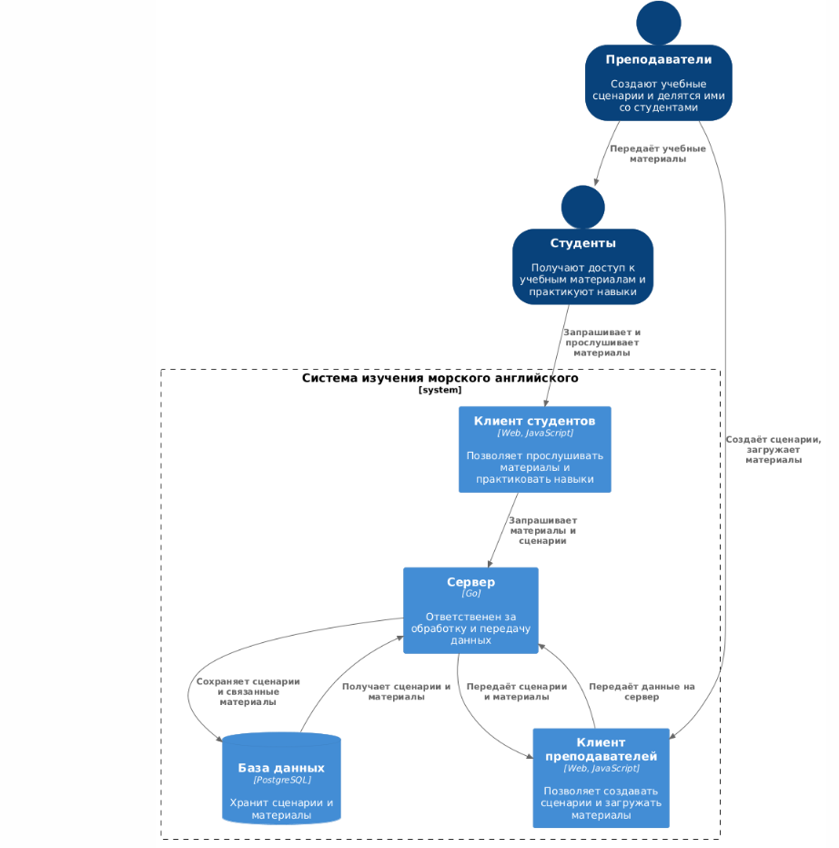
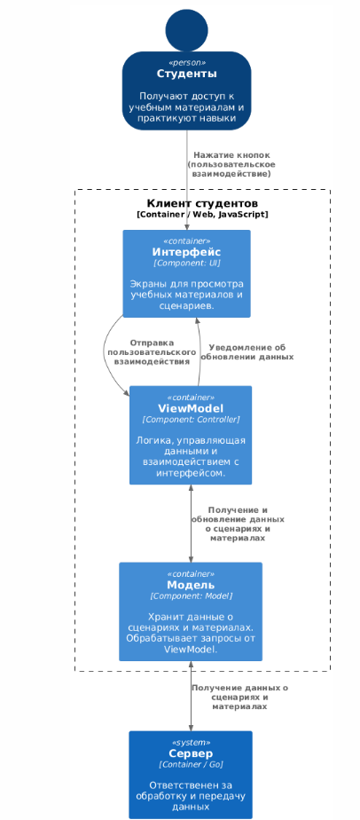
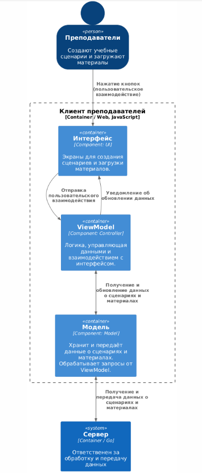
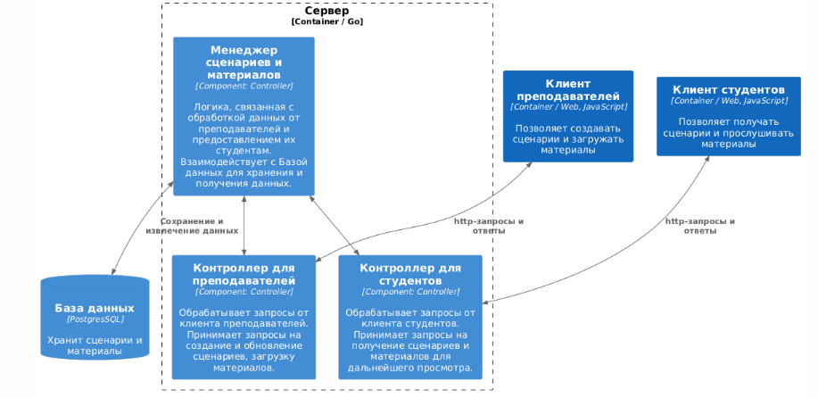

Диаграмма системного контекста

@startuml
!include https://raw.githubusercontent.com/plantuml-stdlib/C4-PlantUML/master/C4_Container.puml

SHOW_PERSON_OUTLINE()

Person(teachers, Преподаватели, "Создают учебные сценарии и материалы")
Person(students, Студенты, "Получают доступ к учебным материалам и практикуют навыки")
Container(c1, "Система изучения морского английского", "System")
Rel_D(teachers, c1, "Создаёт учебные сценарии, загружает материалы, настраивает имитацию переговоров")
Rel_D(teachers, students, "Передаёт учебные материалы")
Rel_D(students, c1, "Получает доступ к учебным материалам, прослушивает и практикует навыки")

SHOW_LEGEND()
@enduml

Диаграмма контейнеров

Выбор архитектурного стиля:
Выбранный стиль: Клиент-Серверная архитектура.

Обоснование:

Централизованное управление данными: Важно иметь централизованное хранилище для сценариев, учебных материалов и
пользовательских данных, что делает сервер естественным местом для их хранения и обработки. Это упрощает управление
и обновление контента.

Обновления в реальном времени: Клиент-Серверная архитектура обеспечивает возможность мгновенного обновления данных
и материалов, что особенно важно для студентов, которые могут получать новые задания и ресурсы в процессе обучения.

Масштабируемость: Этот стиль архитектуры облегчает масштабирование системы, так как сервер может быть расширен для
обработки большего количества пользователей без необходимости изменения клиентских приложений.

Выбор архитектуры уровня приложений:
Выбранная архитектура: MVVM (Model-View-ViewModel).

Обоснование:

Сложность интерфейса: MVVM обеспечивает четкое разделение между данными и логикой отображения, что особенно полезно для
приложений с множеством интерактивных элементов, таких как тесты, видео и сценарии, которые могут быть представлены
в пользовательском интерфейсе.

Связывание данных: MVVM поддерживает эффективное связывание данных между пользовательским интерфейсом и моделью данных,
что критично для отображения актуальных учебных материалов и взаимодействия с ними в реальном времени.

Тестируемость: Архитектура MVVM упрощает тестирование, так как бизнес-логика сосредоточена в ViewModel,
что позволяет тестировать функциональность независимо от пользовательского интерфейса. Это обеспечивает высокое
качество кода и надежность приложения.

Адаптивность интерфейса: MVVM позволяет легко адаптировать пользовательский интерфейс под различные устройства и
разрешения экранов, что важно для обеспечения удобного доступа к учебным материалам на разных платформах, включая
мобильные и десктопные устройства.

@startuml
!include https://raw.githubusercontent.com/plantuml-stdlib/C4-PlantUML/master/C4_Container.puml

SHOW_PERSON_OUTLINE()

Person(teachers, Преподаватели, "Создают учебные сценарии и делятся ими со студентами")
Person(students, Студенты, "Получают доступ к учебным материалам и практикуют навыки")
System_Boundary(c1, "Система изучения морского английского") {
    Container(clientTeachers, "Клиент преподавателей", "Web, JavaScript", "Позволяет создавать сценарии и загружать материалы")
    Container(clientStudents, "Клиент студентов", "Web, JavaScript", "Позволяет прослушивать материалы и практиковать навыки")
    Container(server, "Сервер", "Go", "Ответственен за обработку и передачу данных")
    ContainerDb(db, "База данных", "PostgreSQL", "Хранит сценарии и материалы", $sprite="msql_server")
}

Rel_D(teachers, clientTeachers, "Создаёт сценарии, загружает материалы")
Rel_D(clientTeachers, server, "Передаёт данные на сервер")
Rel_D(server, db, "Сохраняет сценарии и связанные материалы")
Rel_U(db, server, "Получает сценарии и материалы")
Rel_D(server, clientTeachers, "Передаёт сценарии и материалы")
Rel_D(teachers, students, "Передаёт учебные материалы")
Rel_D(students, clientStudents, "Запрашивает и прослушивает материалы")
Rel_D(clientStudents, server, "Запрашивает материалы и сценарии")

SHOW_LEGEND()
@enduml

Диаграмма компонентов

Для клиента студентов

@startuml
!include https://raw.githubusercontent.com/plantuml-stdlib/C4-PlantUML/master/C4_Container.puml

SHOW_PERSON_OUTLINE()

Person(students, Студенты, "Получают доступ к учебным материалам и практикуют навыки")
System(s, "Сервер", "Ответственен за обработку и передачу данных", $type="Container / Go")
Boundary(c, "Клиент студентов", "Container / Web, JavaScript") {
    Container(v, "Интерфейс", "Component: UI", "Экраны для просмотра учебных материалов и сценариев.")
    Container(vm, "ViewModel", "Component: Controller", "Логика, управляющая данными и взаимодействием с интерфейсом.")
    Container(m, "Модель", "Component: Model", "Хранит данные о сценариях и материалах. Обрабатывает запросы от ViewModel.")
}
Rel_D(students, v, "Нажатие кнопок (пользовательское взаимодействие)")
Rel_D(v, vm, "Отправка пользовательского взаимодействия")
Rel_D(vm, v, "Уведомление об обновлении данных")
BiRel(vm, m, "Получение и обновление данных о сценариях и материалах")
BiRel(m, s, "Получение данных о сценариях и материалах")
@enduml

Для клиента преподавателей

@startuml
!include https://raw.githubusercontent.com/plantuml-stdlib/C4-PlantUML/master/C4_Container.puml

SHOW_PERSON_OUTLINE()

Person(teachers, Преподаватели, "Создают учебные сценарии и загружают материалы")
System(s, "Сервер", "Ответственен за обработку и передачу данных", $type="Container / Go")
Boundary(c, "Клиент преподавателей", "Container / Web, JavaScript") {
    Container(v, "Интерфейс", "Component: UI", "Экраны для создания сценариев и загрузки материалов.")
    Container(vm, "ViewModel", "Component: Controller", "Логика, управляющая данными и взаимодействием с интерфейсом.")
    Container(m, "Модель", "Component: Model", "Хранит и передаёт данные о сценариях и материалах. Обрабатывает запросы от ViewModel.")
}
Rel_D(teachers, v, "Нажатие кнопок (пользовательское взаимодействие)")
Rel_D(v, vm, "Отправка пользовательского взаимодействия")
Rel_D(vm, v, "Уведомление об обновлении данных")
BiRel(vm, m, "Получение и обновление данных о сценариях и материалах")
BiRel(m, s, "Получение и передача данных о сценариях и материалах")
@enduml

Для сервера

@startuml
!include https://raw.githubusercontent.com/plantuml-stdlib/C4-PlantUML/master/C4_Container.puml

SHOW_PERSON_OUTLINE()

System(mta, "Клиент преподавателей", "Позволяет создавать сценарии и загружать материалы", $type="Container / Web, JavaScript")
System(mt, "Клиент студентов", "Позволяет получать сценарии и прослушивать материалы", $type="Container / Web, JavaScript")
ContainerDb(db, "База данных", "PostgresSQL", "Хранит сценарии и материалы", $sprite="msql_server")
Boundary(s, "Сервер", "Container / Go") {
    Container(cS, "Контроллер для студентов", "Component: Controller", "Обрабатывает запросы от клиента студентов. Принимает запросы на получение сценариев и материалов для дальнейшего просмотра.")
    Container(cT, "Контроллер для преподавателей", "Component: Controller", "Обрабатывает запросы от клиента преподавателей. Принимает запросы на создание и обновление сценариев, загрузку материалов.")
    Container(m, "Менеджер сценариев и материалов", "Component: Controller", "Логика, связанная с обработкой данных от преподавателей и предоставлением их студентам. Взаимодействует с Базой данных для хранения и получения данных.")
}
BiRel(mt, cS, "http-запросы и ответы")
BiRel(mta, cT, "http-запросы и ответы")
BiRel(m, db, "Сохранение и извлечение данных")
BiRel(m, cS, "")
BiRel(m, cT, "")
SHOW_LEGEND()
@enduml