Метод: POST

URL: /api/v1/users

Описание: Создание нового пользователя.

Тело запроса:

Пример:

`{
    "username": "Имя", - строка
    "password": "Пароль" - строка
}`

Ответ:

`{
    "user_id": 1
}`

Статусы ответов:

Код 201: Пользователь успешно создан.

Код 400: Неверные данные.

Метод: GET

URL: /api/v1/users/{id}

Описание: Получение пользователя.

Ответ:
`{
    "id": 1,
    "username": "Имя"
}`

Статусы ответов:

Код 200: Успешный запрос.

Код 404: Пользователь не найден.

Метод: GET

URL: /api/v1/scenarios

Описание: Получение списка всех учебных сценариев.

Ответ:
`[
    {
        "id": 1,
        "title": "Название сценария",
        "description": "Описание сценария"
    }
]`

Статусы ответов:

Код 200: Успешный запрос.

Код 500: Внутренняя ошибка сервера.

Метод: POST

URL: /api/v1/scenarios

Описание: Создание нового учебного сценария.

Тело запроса:
`{
    "title": "Название сценария", - строка
    "description": "Описание сценария" - строка
}`

Ответ:
`{
    "scenario_id": 1
}`

Статусы ответов:

Код 201: Сценарий успешно создан.

Код 400: Неверные данные.

Метод: PUT

URL: /api/v1/scenarios/{id}

Описание: Обновление существующего учебного сценария.

Тело запроса:
`{
    "title": "Новое название",
    "description": "Новое описание" 
}`

Ответ:
`{
    "id": 1,
    "title": "Новое название",
    "description": "Новое описание"
}`

Статусы ответов:

Код 200: Сценарий успешно обновлен.

Код 404: Сценарий не найден.

Метод: DELETE

URL: /api/v1/scenarios/{id}

Описание: Удаление учебного сценария.

Статусы ответов:

Код 204: Сценарий успешно удален.

Код 404: Сценарий не найден.

Метод: POST

URL: /api/v1/materials

Описание: Загрузка материалов (текстовых или аудиофайлов).

Тело запроса: 
`{
    "name": "Название материала" - строка
}`

Ответ:
`{
    "material_id": 1
}`

Статусы ответов:

Код 201: Материал успешно загружен.

Код 400: Неверные данные.

Метод: GET

URL: /api/v1/materials

Описание: Получение списка всех загруженных материалов.

Ответ:
`[
    {
        "id": 1,
        "name": "Название материала"
    }
]`

Статусы ответов:

Код 200: Успешный запрос.

Код 500: Внутренняя ошибка сервера.

Добавление пользователя

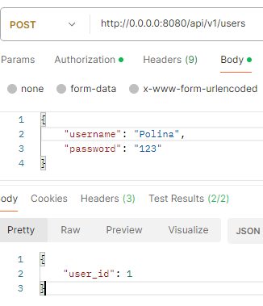

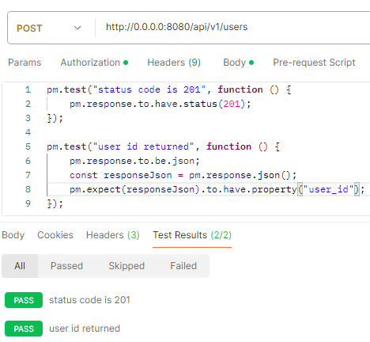

Получение пользователя

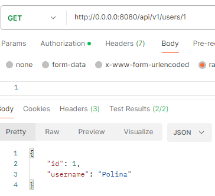
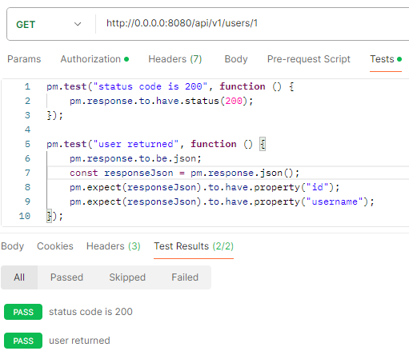

Добавление материала

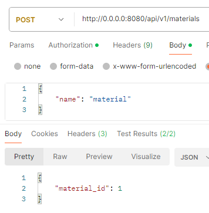
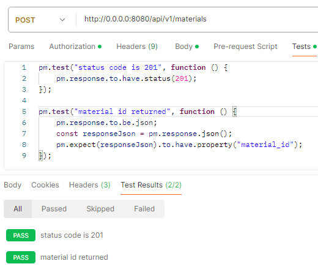

Получение материала

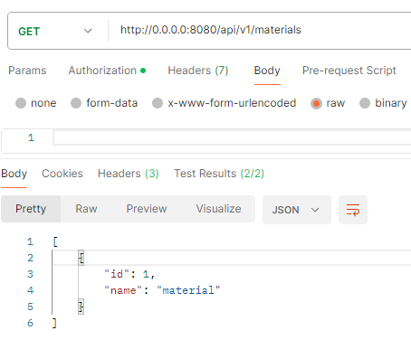
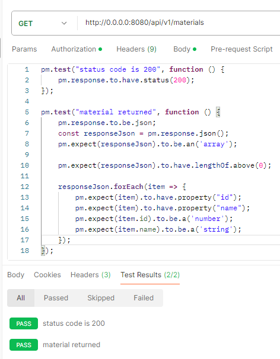

Создание сценария

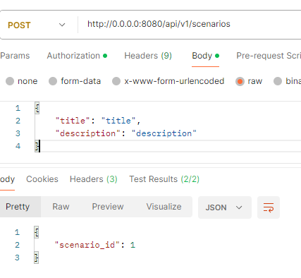
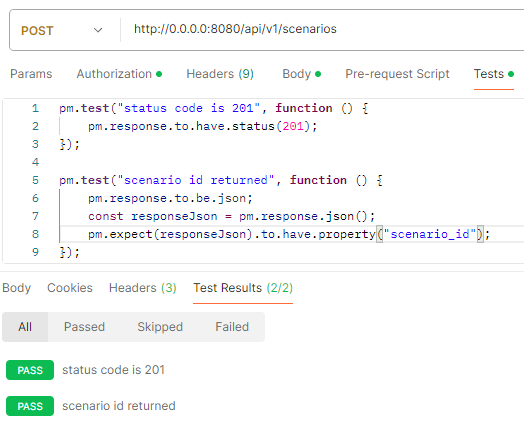

Получение сценария

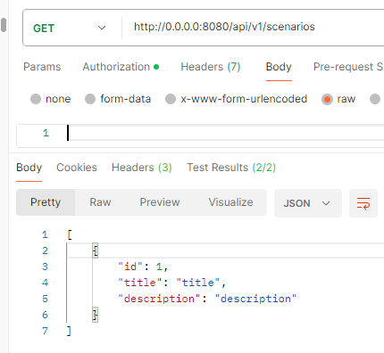
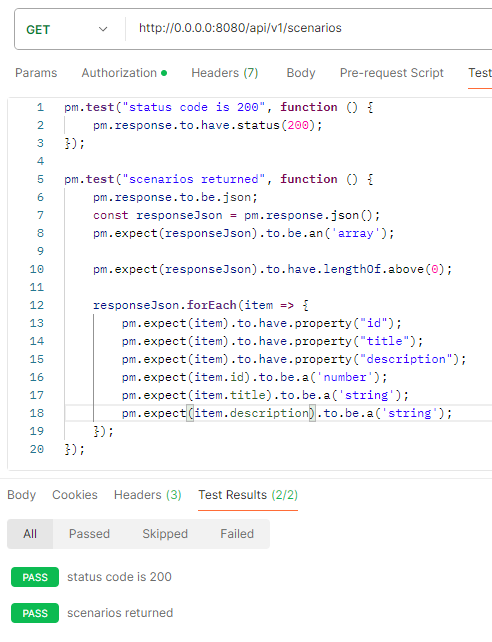

Обновление сценария

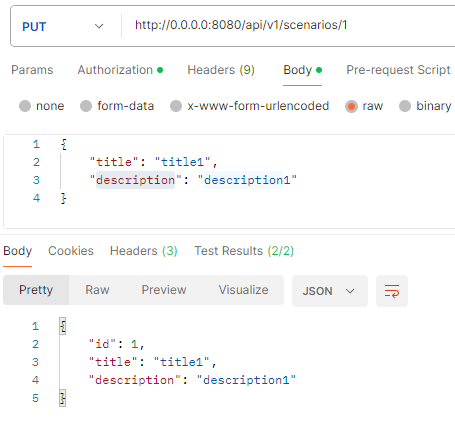
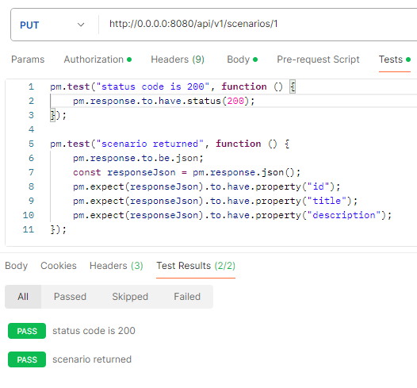

Удаление сценария

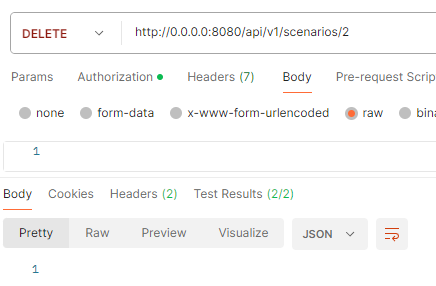
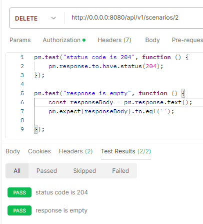